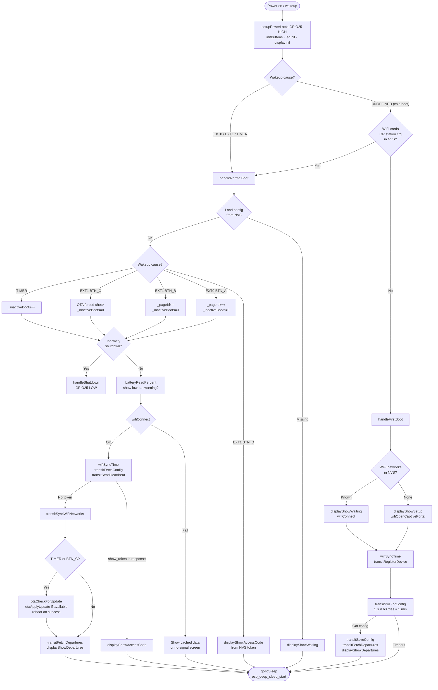
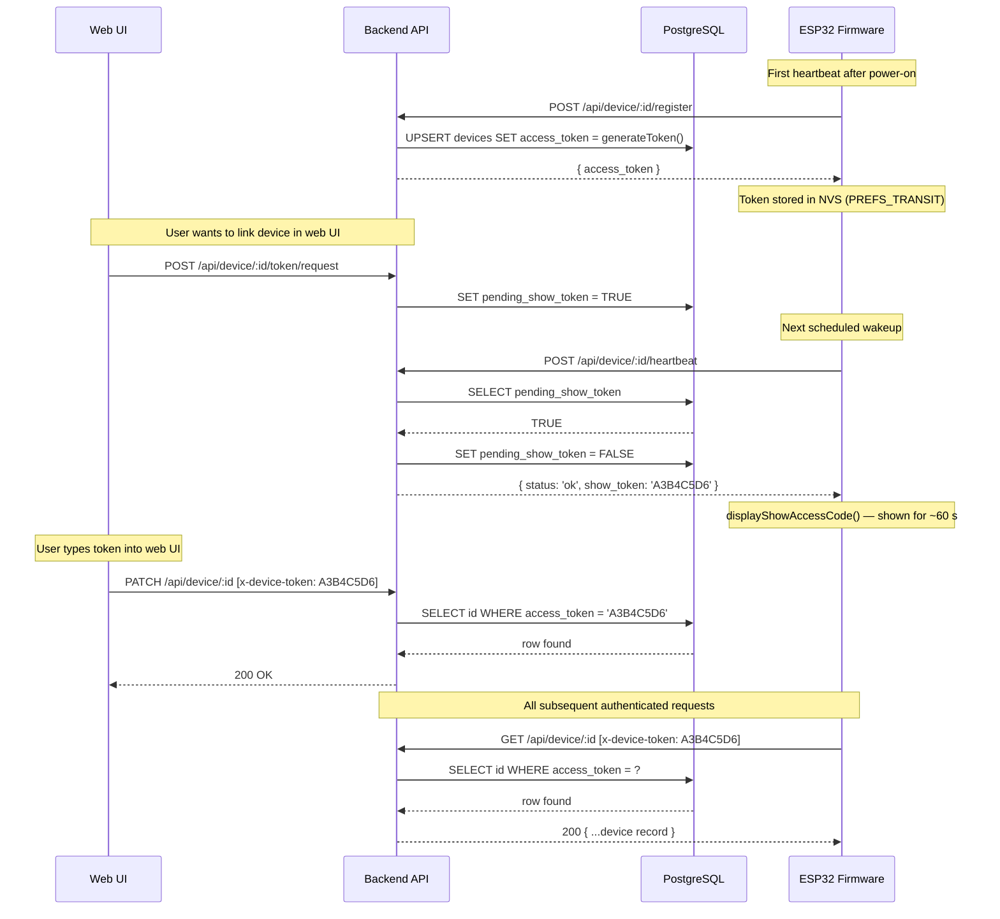
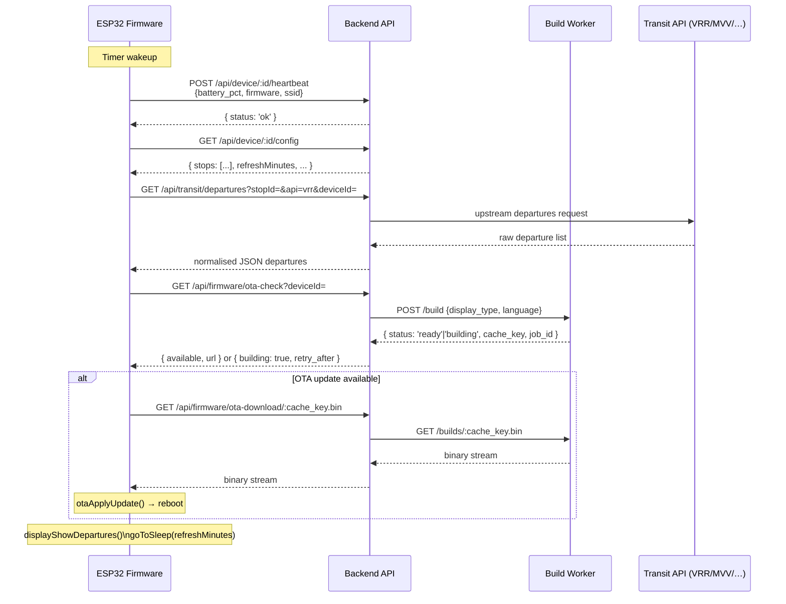

# DepartureMonitor — System Architecture

## System Overview

DepartureMonitor is a battery-powered ESP32 e-paper keychain that shows live public-transit departure times. The firmware wakes from deep sleep, fetches data from a Node.js backend, updates the display, then sleeps again. A separate build-worker service compiles personalised firmware on-demand for OTA delivery.

```mermaid
graph TD
    subgraph Device["ESP32 Firmware (C++ / Arduino)"]
        FW[main.cpp<br/>setup → sleep loop]
    end

    subgraph Backend["Backend (Node.js / Express)"]
        API[REST API :3000]
        DB[(PostgreSQL)]
        OTA_DIR[/data/firmware/]
        API --- DB
        API --- OTA_DIR
    end

    subgraph BuildWorker["Build Worker (Node.js)"]
        BW[PlatformIO compiler :3001]
        CACHE[/builds/ cache]
        BW --- CACHE
    end

    subgraph TransitAPIs["Upstream Transit APIs"]
        VRR[VRR]
        MVV[MVV]
        DB2[Deutsche Bahn]
        HVV[HVV]
    end

    WebUI["Web UI (Frontend)"]

    FW -- "HTTPS REST" --> API
    API -- "HTTP" --> BW
    BW -- ".bin proxy" --> API
    API -- "departures / stops / weather" --> TransitAPIs
    WebUI -- "HTTPS REST" --> API
    WebUI -. "OTA upload (admin)" .-> API
```

---

## Boot Flow

Every Arduino `setup()` call is a full boot. Work is done in setup; the loop body is never reached. Deep sleep is entered at the end of each path.



---

## Authentication Flow

Device identity is established via an 8-character uppercase hex token (`generateToken()`, stored as `access_token` in the `devices` table). The token is printed to the e-paper display exactly once after a web-UI request, then cleared from the pending queue.



---

## Deep Sleep Architecture

The ESP32 spends the vast majority of its lifetime in deep sleep. Power to the board itself is held via a P-channel MOSFET controlled by **GPIO25** (PWR_HOLD); the RTC domain stays alive to maintain wakeup logic and persistent variables.

### Power latch

`setupPowerLatch()` is the very first thing called in `setup()`:

1. Releases any previous `rtc_gpio_hold_en` from the prior boot.
2. Configures GPIO25 as an RTC output and drives it HIGH.
3. Calls `rtc_gpio_hold_en(GPIO_NUM_25)` — this ensures the HIGH level is **retained through deep sleep** (standard `gpio_hold_en` is unreliable during deep-sleep on ESP32).

To shut down, `handleShutdown()` calls `rtc_gpio_hold_dis()` then drives GPIO25 LOW, cutting power to the board entirely.

### RTC-retained variables (`RTC_DATA_ATTR`)

These survive every deep-sleep cycle and are zero-initialised only on a true power-on reset:

| Variable | Type | Purpose |
|---|---|---|
| `_bootCount` | `uint32_t` | Monotonic boot counter |
| `_lastHadRed` | `bool` | Whether the previous frame contained red pixels (BWR partial refresh guard) |
| `_pageIdx` | `int` | Current station page index |
| `_inactiveBoots` | `int` | Timer-wakeup boots since last button press (for auto-shutdown) |
| `_lastUpdateStr` | `char[6]` | Last successful update time ("HH:MM") shown in footer during offline boots |
| `_otaAvailable` | `bool` | Cached OTA availability flag shown in footer |

### Wakeup sources

| Source | GPIO / mechanism | Trigger |
|---|---|---|
| Timer | `esp_sleep_enable_timer_wakeup` | `refreshMinutes × 60 s` |
| BTN_A | EXT0, GPIO26, active LOW | Next station page |
| BTN_B | EXT1, GPIO27, active HIGH | Previous station page |
| BTN_C | EXT1, GPIO14, active HIGH | Force OTA check |
| BTN_D | EXT1, GPIO15, active HIGH | Show access token from NVS |

BTN_A uses EXT0 (single-pin, level-triggered). BTN_B/C/D use EXT1 (`ESP_EXT1_WAKEUP_ANY_HIGH`) with RTC pull-downs to keep pins stable at LOW during sleep.

---

## Display Refresh Strategy

The device supports two e-paper display variants selected at build time:

| Build flag | Hardware | Driver | Red channel |
|---|---|---|---|
| *(default)* | GDEW0213Z98c | `GxEPD2_3C` | Yes — black + red + white |
| `DISPLAY_BW` | GDEW0213BN | `GxEPD2_BW` | No — `GxEPD_RED` maps to black |

### Partial vs full refresh

BWR (3-colour) displays require a **full refresh** (~15 s) to update the red channel. BW (2-colour) displays support **partial refresh** (~500 ms), which only redraws changed pixels.

To minimise visible flicker on BWR panels:

- `_lastHadRed` (RTC memory) tracks whether the previous frame contained any red pixels.
- On the next boot, if neither the new frame nor the cached previous frame contain red, the driver uses partial refresh.
- If either frame has red, a full refresh is forced.

This strategy keeps the majority of timer-wakeup refreshes fast (no red departures in the next 4 rows) while ensuring the red channel is always correct when needed.

### Display layout (250 × 122 px, rotation = 1)

```
┌─────────────────────────────────────────────┐  y=0
│ [icon] Station name              [bat icon] │  header baseline y=13
├─────────────────────────────────────────────┤  y=18 (DIV1)
│ [type] LINE  Destination          +X min    │  row 1 (y=22)
│ [type] LINE  Destination          HH:MM     │  row 2 (y=42)
│ [type] LINE  Destination          +X min    │  row 3 (y=62)
│ [type] LINE  Destination          HH:MM     │  row 4 (y=82)
├─────────────────────────────────────────────┤  y=105 (DIV2)
│ Page N/M  [OTA icon]              HH:MM     │  footer baseline y=119
└─────────────────────────────────────────────┘  y=122
```

---

## Data Flow — Departure Refresh Cycle


